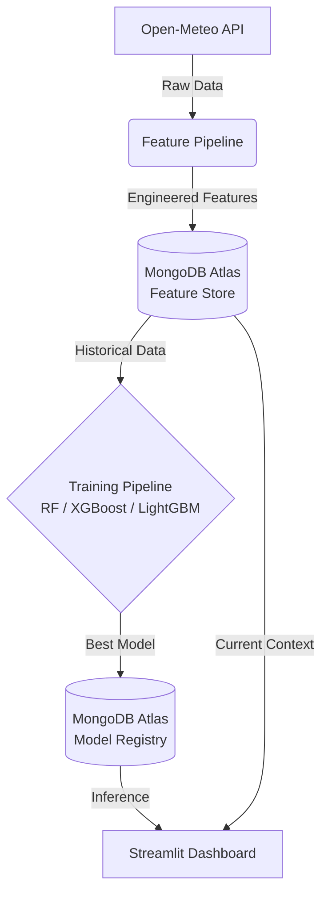

# Pearls AQI Predictor — End-to-End Air Quality Forecasting


> Predict the **Air Quality Index (AQI)** for any city for the next **3 days** using a robust, 100% serverless Machine Learning stack.

---

## 🚀 Overview

The **Pearls AQI Predictor** is an automated, end-to-end machine learning pipeline that fetches real-time meteorological and pollutant data, engineers predictive features, trains state-of-the-art tree-based models, and serves forecasts via an interactive web dashboard. 

Built entirely on a **serverless architecture**, it requires zero dedicated infrastructure, leveraging GitHub Actions for orchestration and MongoDB Atlas as a centralized Feature Store and Model Registry.

### ✨ Key Features
* **100% Serverless:** Completely automated using GitHub Actions (cron jobs).
* **Zero Cost Data:** Integrates with the Open-Meteo API (No API keys required).
* **Advanced ML:** Utilizes Random Forest, XGBoost, and LightGBM for robust time-series forecasting.
* **Explainable AI:** Integrates SHAP values to explain model predictions.
* **Interactive UI:** A sleek Streamlit dashboard powered by Plotly visualizations.

---

## 🏗️ Architecture



---

## 🛠️ Tech Stack

| Category | Tool / Technology |
| --- | --- |
| **Data Source** | Open-Meteo Air Quality API |
| **Database (Feature/Model Store)** | MongoDB Atlas (Free Tier) |
| **Machine Learning** | `scikit-learn`, `xgboost`, `lightgbm` |
| **Explainability** | `shap` |
| **Web Dashboard** | Streamlit, Plotly |
| **CI/CD & Orchestration** | GitHub Actions |

---

## 🚦 Quick Start Guide

Follow these instructions to run the project locally.

### 1. Clone & Install Dependencies

```bash
git clone [https://github.com/axhhad-khan/Pearls-AQI-Predictor.git](https://github.com/axhhad-khan/Pearls-AQI-Predictor.git)
cd Pearls-AQI-Predictor
pip install -r requirements.txt

```

### 2. Environment Configuration

Copy the environment template and configure your MongoDB connection string. *(Note: The Open-Meteo API does not require a key).*

```bash
cp .env.example .env

```

**`.env` Configuration:**

```ini
MONGO_URI=mongodb+srv://<username>:<password>@cluster.mongodb.net/
MONGO_DB_NAME=aqi_predictor
CITY_NAME=Karachi
LATITUDE=24.8607
LONGITUDE=67.0011

```

### 3. Backfill Historical Data

Fetch the last 30 days of data to populate your feature store:

```bash
python backfill.py --days 30

```

### 4. Train the Models

Run the training pipeline to evaluate models and save the best performer to the registry:

```bash
python run_training_pipeline.py

```

### 5. Launch the Dashboard

Fire up the Streamlit interface to view predictions:

```bash
streamlit run app.py

```

---

## 📂 Project Structure

```text
aqi_predictor/
├── 📁 pipelines/
│   ├── fetch_data.py               # Open-Meteo API data ingestion
│   ├── feature_pipeline.py         # Feature engineering & AQI computation
│   └── training_pipeline.py        # Model training & SHAP integration
├── 📁 utils/
│   └── db.py                       # MongoDB connection & registry logic
├── 📁 .github/workflows/
│   └── pipelines.yml               # GitHub Actions CI/CD workflows
├── app.py                          # Streamlit dashboard entrypoint
├── backfill.py                     # Historical data backfill script
├── run_feature_pipeline.py         # CI/CD hourly feature runner
├── run_training_pipeline.py        # CI/CD daily training runner
├── requirements.txt                # Python dependencies
└── .env.example                    # Environment variables template

```

---

## 🧠 Machine Learning Details

### Feature Engineering

Our pipeline extracts and engineers a rich set of features to capture temporal patterns and meteorological dependencies:

| Feature Category | Description |
| --- | --- |
| **Temporal & Cyclical** | `hour`, `day_of_week`, `is_weekend`, `hour_sin/cos`, `month_sin/cos` |
| **Pollutants** | PM2.5, PM10, CO, NO₂, SO₂, O₃ |
| **Meteorological** | Temperature, humidity, wind speed/direction, pressure, precipitation |
| **Lag & Rolling** | AQI lags (1h, 3h, 6h, 24h), rolling means, AQI change rates |

### Model Selection

All models are evaluated on a held-out temporal test split predicting **AQI 24 hours ahead**. Metrics tracked include **RMSE**, **MAE**, and **R²**. The best-scoring model is automatically promoted to the registry.

* **Random Forest:** `n_estimators=200`, `max_depth=12`
* **XGBoost:** `n_estimators=300`, `learning_rate=0.05`, `subsample=0.8`
* **LightGBM:** `n_estimators=300`, `num_leaves=63`, `learning_rate=0.05`

---

## ⚙️ CI/CD Automation

The entire pipeline is automated via GitHub Actions. To enable this on your fork, add the following to your **Repository Secrets** (`Settings -> Secrets and variables -> Actions`):

* `MONGO_URI`
* `MONGO_DB_NAME`
* `CITY_NAME`
* `LATITUDE`
* `LONGITUDE`

**Cron Schedules:**

* 🕒 **Feature Pipeline:** Runs every hour (`0 * * * *`)
* 📅 **Training Pipeline:** Runs daily at 02:00 UTC (`0 2 * * *`)

---

## 📊 AQI Reference Scale (US EPA)

The dashboard automatically triggers visual alerts for hazardous conditions based on the standard US EPA scale:

| AQI Level | Category | Color Indicator |
| --- | --- | --- |
| **0 – 50** | Good | 🟢 |
| **51 – 100** | Moderate | 🟡 |
| **101 – 150** | Unhealthy for Sensitive Groups | 🟠 |
| **151 – 200** | Unhealthy | 🔴 |
| **201 – 300** | Very Unhealthy | 🟣 |
| **301 – 500** | Hazardous | 🔴⚫ |

---

*Developed with ❤️ by [Ashhad Khan](https://github.com/axhhad-khan).*